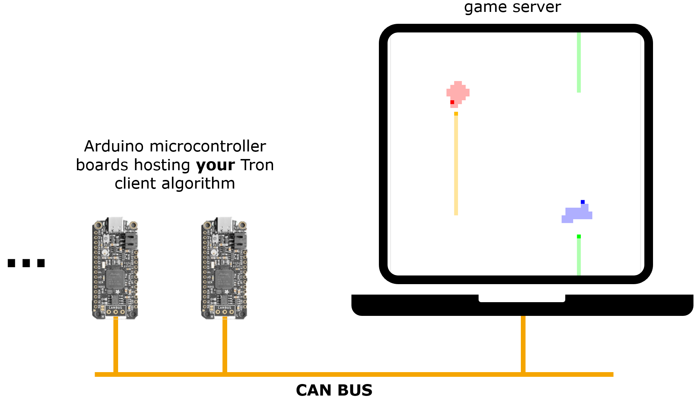

# Vector-Hackathon Game

The Game is a snake-like game. The objective is to force the enemy players to crash into players trail or each other, while simultaneously avoiding them. When an enemy crashes, both it and its trail disappear. Here is an example grid with two players (blue and yellow):

In our Game there are 4 players playing against each other on a single game grid. Depending on how early they crash, they'll be rewarded with points. The movements of each player is controlled by a dedicated program running on a small Arduino microcontroller board (very limited space for your smart artificial intelligence algorithms). A central game server sets up the game and regularly notifies about the game state (every 100ms) and who has crashed. The actual program that controls the player is designed and implemented by a team of about 4 people. There will be around 10 - 11 teams competing in a tournament of multiple 4-player games. The team with the most points in the end wins the competition.

# Technical Setup

The game server logic will be hosted on a dedicated computer also providing a visualization of the game in real-time. The actual communication between the Arduino microcontroller boards and the game server is realized via a single CAN bus to which all nodes and the game server are connected.

All nodes and the game server communicate with the help of several game rules and a predefined communication protocol. This protocol defines messages and their payloads sent over the CAN bus. The documentation of the protocol can be found <a href="protocol.md">here</a>.

