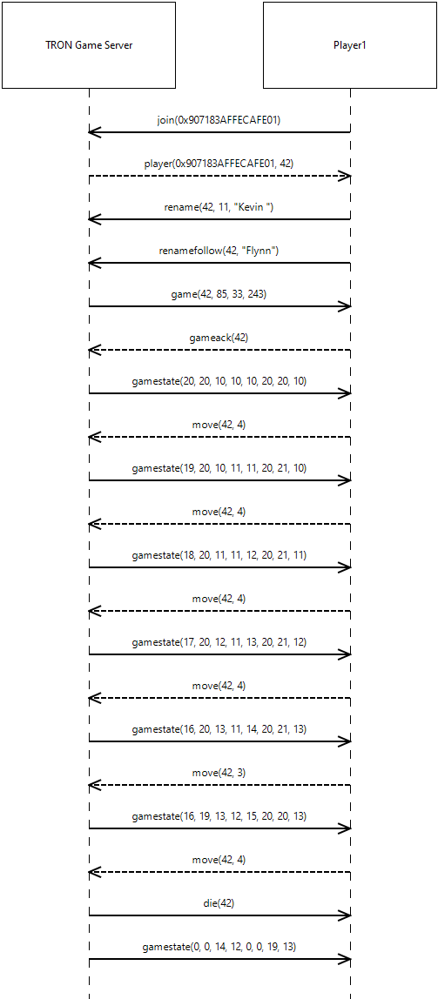

# Game CAN Protocol

The protocol between the game server and several clients supports the following things during the setup phase:
* new players can join
* server assigns unique IDs to newly joined players
* players can set their own names (optional)

During the game playing phase the following things are supported:
* server detects errors and sends error messages
* server starts a new game always with 4 players
* each player has to declare that he is ready for the game
* server starts the new game and periodically sends player position updates
* players can change their current move direction
* server notifies if a player dies
* server notifies once the game is finished
* only one game at a time is active
* server reports most common error cases

## Message Types

### join

The join message is the first message a player has to send to the server. The provided hardware ID must be globally unique (at least within the tournament). The server then assigns a player ID to that hardware ID.

**Name:** join  
**Sender:** Client  
**Expected reply:** player  
**FrameID:** 0x100  
**Arguments:**
| # | Type   | Description  |
|---|--------|--------------|
| 1 | uint32 | hwID         |

**Example:** `join|1719` - the player with the hardware ID 1719 wants to join and requests a player ID

### player

The server's response message to a join message from a client acknowledges the join and provides the player with a player ID. After the player ID has been provided by the server it must be used for further communication from here on.

**Name:** player  
**Sender:** Server  
**Expected reply:** -  
**FrameID:** 0x110  
**Arguments:**
| # | Type    | Description   |
|---|---------|---------------|
| 1 | uint32  | hwID          |
| 2 | uint8   | player ID     |

**Example:** `player|1719|1` - the player with the hardware ID 1719 is assigned the player ID 1 for future communication

### rename/renamefollow

The player can set his/her name for display during the visualization of the game. The name us up to 20 ASCII characters long and can be set via two different messages:

**Name:** rename  
**Sender:** Client  
**Expected reply:** -  
**FrameID:** 0x500  
**Arguments:**
| # | Type    | Description   |
|---|---------|---------------|
| 1 | uint8   | playerID      |
| 2 | uint8   | size (bytes)  |
| 3 | char[6] | first 6 chars |

**Example:** `rename|1|17|"Kevin "` - player with ID 1 would like to rename himself to a character sequence of length 17 with the first 6 characters being "Kevin "

**Name:** renamefollow  
**Sender:** Client  
**Expected reply:** -  
**FrameID:** 0x510  
**Arguments:**
| # | Type    | Description  |
|---|---------|--------------|
| 1 | uint8   | playerID     |
| 2 | char[7] | next 7 chars |

**Example1:** `renamefollow|1|"Flynn's"` - player with ID 1 sends a follow message to provide the next 7 characters of his name  
**Example2:** `renamefollow|1|" son"` - player with ID 1 sends the last 4 characters of his name in this message

### game

The game message is sent by the server and informs all players that a new game is about to start. Once all 4 players have acknowledged and declared that they are ready for a new game within a timeframe of 100ms after this message, the server will start the game. There are always 4 player for each game. If at least one player does not acknowledge within 100ms the game will get canceled. 

**Name:** game  
**Sender:** Server  
**Expected reply:** gameack  
**FrameID:** 0x040  
**Arguments:**
| # | Type  | Description |
|---|-------|-------------|
| 1 | uint8 | player1 ID  |
| 2 | uint8 | player2 ID  |
| 3 | uint8 | player3 ID  |
| 4 | uint8 | player4 ID  |

**Example:** `game|9|4|1|78` - a new game is about to start with the first player having ID 9, the second ID 4, the third ID 1, and the fourth having ID 78

### gameack

Each player who is requested via the `game` message to participate in a game has to react to this request by sending an acknowledge message containing his own player ID.

**Name:** gameack  
**Sender:** Client  
**Expected reply:** -  
**FrameID:** 0x120  
**Arguments:**
| # | Type  | Description |
|---|-------|-------------|
| 1 | uint8 | player ID   |

**Example:** `gameack|78` - player with ID 78 confirms his requested participation in the game about to start and is ready

### gamestate

After a `game` message has been sent and all players have replied within 100ms the server starts periodically sending `gamestate` update messages. A game state always contains the current positions of each player on the grid. If a player already died (by colliding with another player or his trace), his position will be 255,255 in the `gamestate` message.  
The grid is 64x64, [0..63]x[0..63] to be precise. The bottom left corner is position 0,0. The grid thereby wraps arround on all borders, i.e., it has no walls. For example, if a player moves right from position 63,19 the next position will be at 0,19.  
The starting points per player are the following points on the grid:
| player# | x  | y  |
|---------|----|----|
| 1       | 16 | 48 |
| 2       | 48 | 48 |
| 3       | 48 | 16 |
| 4       | 16 | 16 |

The direction of a player is initially UP. After each `gamestate` message the players can update their movement direction within 80ms. The period of the `gamestate` messages is 100ms and serves as a game tick. During each tick, a player can only move one position. The resulting new position is then sent via the next `gamestate` message. A player dies if the resulting position was previously occupied by any other player, i.e., players leave traces. Head on collisions are also possible, i.e., if two players would be in the same position in the next game tick, they both die.

**Name:** gamestate  
**Sender:** Server  
**Expected reply:** -  
**FrameID:** 0x050  
**Arguments:**
| # | Type  | Description |
|---|-------|-------------|
| 1 | uint8 | player1 x   |
| 2 | uint8 | player1 y   |
| 3 | uint8 | player2 x   |
| 4 | uint8 | player2 y   |
| 5 | uint8 | player3 x   |
| 6 | uint8 | player3 y   |
| 7 | uint8 | player4 x   |
| 8 | uint8 | player4 y   |

**Example:** `gamestate|16|48|48|48|48|16|16|16` - first `gamestate` message will always sent this content

### move

With this message, players can send move direction updates for the next game tick. If multiple updates are sent during a single game tick, the most recent move direction superseeds the previous ones. If no update is sent the direction remains the same.  
There are four directions encoded as numbers: `UP` = 1; `RIGHT` = 2; `DOWN` = 3; `LEFT` = 4; Obviously, you can not move backwards, i.e., if you moved up in the previous game tick, you cannot move down in the next update. So these updates will just be ignored.

**Name:** move  
**Sender:** Client  
**Expected reply:** -  
**FrameID:** 0x090  
**Arguments:**
| # | Type  | Description |
|---|-------|-------------|
| 1 | uint8 | player ID   |
| 2 | uint8 | direction: `UP` = 1; `RIGHT` = 2; `DOWN` = 3; `LEFT` = 4; |

**Example:** `move|78|2` - player with ID 78 wants to move right

### die

If a player collides with a trace or another player, he dies. This message will be sent before the next `gamestate` message. A player who has just died will also immediately remove him and his trace from the grid, providing more room for the remaining players. If another player collides with a trace of a player that just died in the same game tick, he will also die. So within one game tick first the players die, then their traces are removed.

**Name:** die  
**Sender:** Server  
**Expected reply:** -  
**FrameID:** 0x080  
**Arguments:**
| # | Type  | Description |
|---|-------|-------------|
| 1 | uint8 | player ID   |

**Example:** `die|78` - player with ID 78 just died

### gamefinish

When the third player in a game just died, the following `gamestate` message will not be sent. Instead, the game is finished, points will be given to each player, and the game server stops sending updates for that game, so that another game can now be started. The points given to the players are sent with this `gamefinish` message for your information. The points are thereby awarded depending who died first, second, and third. The first player who died receives 1 point, second receives 2 points and so on. If the first and the second deaths happen at the same time, both players will receive only one point.

**Name:** gamefinish  
**Sender:** Server  
**Expected reply:** -  
**FrameID:** 0x070  
**Arguments:**
| # | Type  | Description    |
|---|-------|----------------|
| 1 | uint8 | player1 ID     |
| 2 | uint8 | player1 points |
| 3 | uint8 | player2 ID     |
| 4 | uint8 | player2 points |
| 5 | uint8 | player3 ID     |
| 6 | uint8 | player3 points |
| 7 | uint8 | player4 ID     |
| 8 | uint8 | player4 points |

**Example:** `gamefinish|9|1|4|3|1|4|78|2` - the game is finished, player with ID 9 receives 1 point, playeri with ID 4 receives 3 points, player with ID 1 receives 4 points, and player with ID 78 receives 2 points

### error

There are several situations where an error could happen. The most common ones will be noticed by the server and an error message is sent on the bus. So far the following error codes are supported:

| number | literal | description |
|--------|---------|-------------|
| 1      | ERROR_INVALID_PLAYER_ID | The provided playerID is not in the registry of the server (no previous `join` message has been sent) |
| 2      | ERROR_UNALLOWED_RENAME | If the provided rename size is greater than 20, or the `renamefollow` message was sent without the size being large enough |
| 3      | ERROR_YOU_ARE_NOT_PLAYING | If a player sends `gameack` or `move` messages without being requested for the currently running game |
| 4      | WARNING_UNKNOWN_MOVE | If the number in the `move` message does not correspond to a valid move direction, the `move` message will just be ignored |

**Name:** error  
**Sender:** Server  
**Expected reply:** -  
**FrameID:** 0x020  
**Arguments:**
| # | Type  | Description |
|---|-------|-------------|
| 1 | uint8 | player ID   |
| 2 | uint8 | error code  |

**Example:** `78|4` - player with ID 78 tried to move in an invalid direction

An example game runthrough from the perspective of a single player (called "Player1") can be seen in the following sequence diagram:

